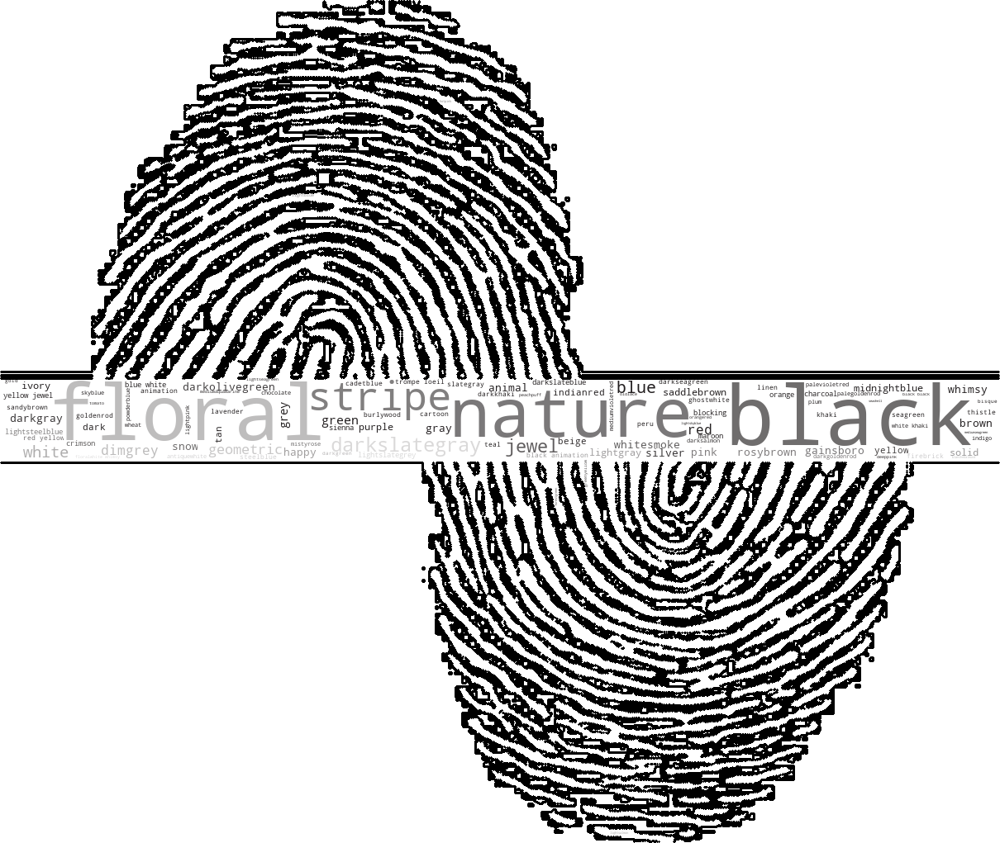

# Resonance Homework 

## Project Title : Resonance - Labelling Image Color, Body and Style  
  + By : Yilin Lyu, Columbia University (yl3832@columbia.edu)
___

<p align="center">
 
</p>

___

## Summary:  
  + There are three tables to be labeled including **_Color, Body_** and **_Style_**. 
  + For the images in Color table:
  + To be labeled: **_Brightness, Contrast, Color, Field, Genre_**
  	+ Using existing *OpenCV measurement* to label **_Brightness and contrast_**.
  	+ Using *K-Means* to find the dominant colors in images as the labels for **_color_**.
  	+ Using image *segmentation* to find the **_field_**.
  	+ Using *KNN* to find the **_genre_** of the picture. 
  + For the images in Body table: 
  	+ Using *KNN* to find the closest descriptions with top frequencies to the target image as the body tags.
  + For the images in Style table:
  	+ Notice that we could add tags to the **style** dataset according to **_Resonance_code_**.
    
    + A **Resonance_code** includes three parts: *body_tag_code* + *material_tag_code* + *color_tag_code*.
    For example: a cloth with Resonance_code: CM-3003 SGT19 WHITUI means:
		+ ZIP HOODIE (CM-3003) with hite w/Thin Navy Vertical Stripe (WHITUI)

  + Numbers of new labels created: 

    Color            |  Body        | Style 
    :-------------------------:|:-------------------------:|:-------------------------
      1285  |  512 | 4252
    


  + Labeled tables are saved [here](./results)
  + Code and detailed explainations are saved [here](./notebooks)
  + Visualizations of the data are saved [here](./visualizations)
  + AirTable version results are saved [here](https://airtable.com/invite/l?inviteId=invvHxAAd2x4pHVb2&inviteToken=2a034a45b244fb63c1eadaf597fe403d94ff58ac3bcd979f7fd64e497ee4e1a2)

___


## Examples of labelling results:  
  + Color Image: 

  Color Image            |  Predictions
:-------------------------:|:-------------------------:
    | 
 	 
  
  + Body Image with predictions:  

  
  

___

## Structure of this repo: 

Please see all the folders for a .README file. 
```
proj/
├── notebooks/ 
├── figs/  
├── visualizations/ 
├── results/ 
```
