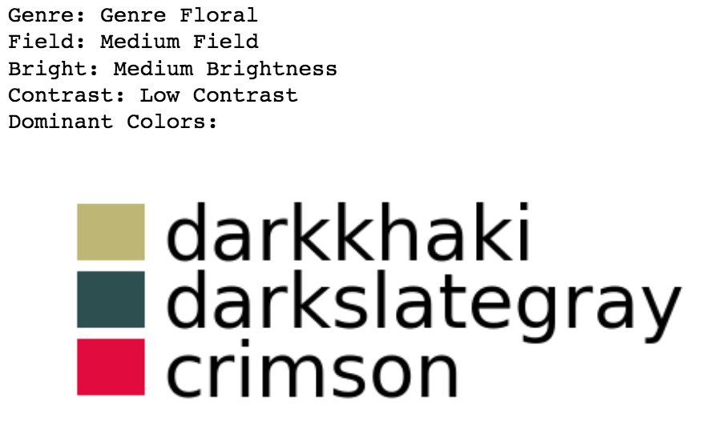
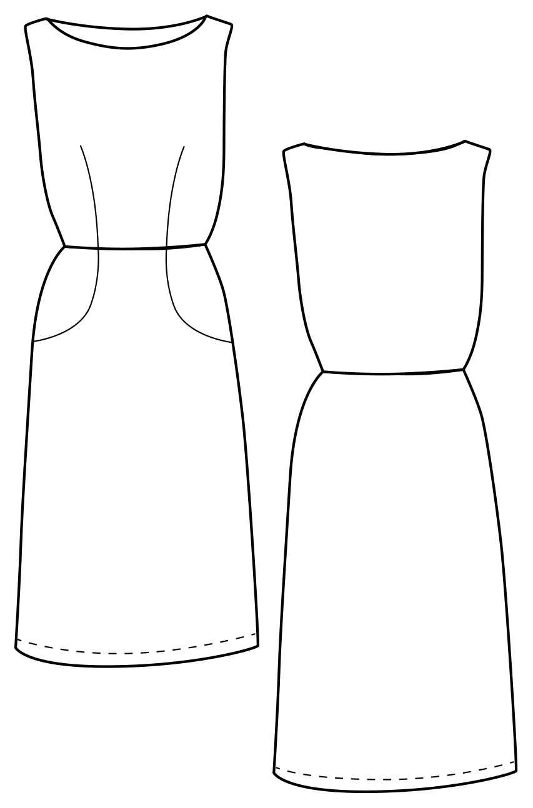
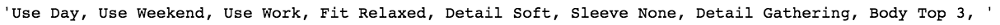

# Resonance

Resonance Homework 

+ **Project Title**: Resonance - Labelling Image Color Body and Style   
  + Color Image: {width="50" height="50"}
  
 	 + Predictions:  
  + Body Image:  
  	 + Predictions:  
+ **By**:  
  + Yilin Lyu: Columbia University (yl3832@columbia.edu)
+ **Summary**:  
Advanced deblurring techniques for computed tomography (CT) images are necessary and crucial to the improvement of accuracy of patient diagnosis in radiology and patient setup and treatment response assessment in radiation oncology. Currently, medical image deblurring is a challenging technical problem due to the unpredictability of patient motion. This paper introduces a new method of computed tomography image deblurring based on Conditional Generative Adversarial Networks (CGAN) that have been broadly implemented in computer vision research [DeblurGAN](https://arxiv.org/pdf/1711.07064.pdf). A Wasserstein Generative Adversarial Network (WGAN) with **adversarial loss** and **l1** perceptual loss was proposed and trained by a blur-sharp image pair dataset created in-house and evaluated by Peak Signal to Noise Ratio [(PSNR)](https://en.wikipedia.org/wiki/Peak_signal-to-noise_ratio) and Structural Similarity Index [(SSIM)](http://www.imatest.com/docs/ssim/). These experiments showed the effectiveness of the approach, which outperforms other competing deblurring techniques both quantitatively and qualitatively.


   
        Below shows an example of the deblurred and blurry images (from left to right).   
 

```
proj/
├── code/ 
├── figs/  
```

Please see each subfolder for a README file.