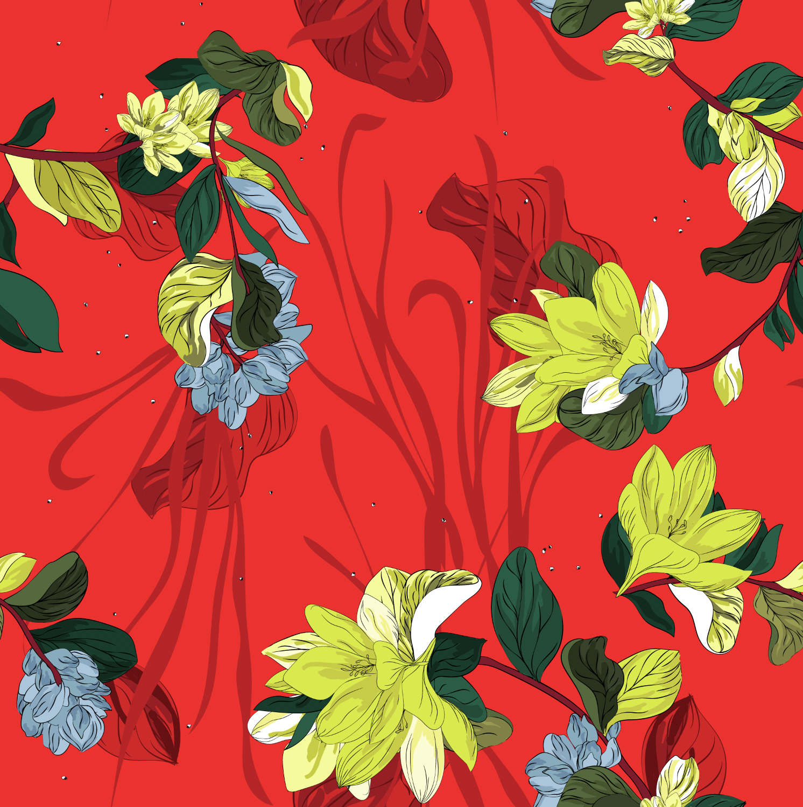

# Resonance

Resonance Homework 

+ **Project Title**: Resonance - Labelling Image Color Body and Style  
+ **By**: 
  + Yilin Lyu: Columbia University (yl3832@columbia.edu)

___
+ **Summary**:  
  + There are three tables to be labeled including **Color, Body** and **Style**. 
  + For the images in Color table, to be labeled: **Brightness, Contrast, Color, Field, Genre**
  	+ Use existing *OpenCV measurement* to label **Brightness and contrast**.
  	+ Use *K-Means* to find the dominant colors in images as the labels for **color**.
  	+ Use image *segmentation* to find the **field**.
  	+ Use *KNN* to find the *genre* of the picture. 
  + For the images in Body table: 
  	+ Use *KNN* to find the closest descriptions with top frequencies to the target image as the body tags.
  + For the images in Style table:
  	+ Notice that we could add tags to the **style** dataset according to **Resonance_code**
    A **Resonance_code** includes three parts: *body_tag_code* + *material_tag_code* + *color_tag_code*.
    For example: a cloth with Resonance_code: CM-3003 SGT19 WHITUI means:
      
      ZIP HOODIE (CM-3003) with hite w/Thin Navy Vertical Stripe (WHITUI)

___


+ **Examples of labelling results**:  
  + Prediction of Color Image: 

     
 	 
  + Prediction of Body Image: 

  
  


   
        Below shows an example of the deblurred and blurry images (from left to right).   
 

```
proj/
├── code/ 
├── figs/  
```

Please see each subfolder for a README file.