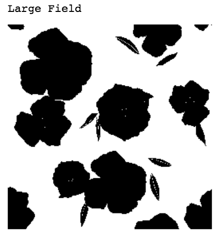

# Resonance Homework 

## Notebooks: 
___

## Summary:  
  + There are three tables to be labeled including **_Color, Body_** and **_Style_**. 
  + For the images in Color table: [here](.label_color.ipynb)
  + To be labeled: **_Brightness, Contrast, Color, Field, Genre_**
  	+ Using existing *OpenCV measurement* to label **Brightness and contrast**.
  	+ Using *K-Means* to find the dominant colors in images as the labels for **_color_**.
  	+ Using image *segmentation* to find the **_field_**.
  	+ Using *KNN* to find the **_genre_** of the picture. 
  + For the images in Body table: [here](.label_body.ipynb)
  	+ Using *KNN* to find the closest descriptions with top frequencies to the target image as the body tags.
  + For the images in Style table: [here](.label_style.ipynb)
  	+ Notice that we could add tags to the **style** dataset according to **_Resonance_code_**
    A **Resonance_code** includes three parts: *body_tag_code* + *material_tag_code* + *color_tag_code*.
    For example: a cloth with Resonance_code: CM-3003 SGT19 WHITUI means:
		+ ZIP HOODIE (CM-3003) with hite w/Thin Navy Vertical Stripe (WHITUI)

___

## Examples of labelling results:  
  + Color Image: 

  Color Image            |  Segmentation Field Prediction  
:-------------------------:|:-------------------------:
    | 
    | 

  Color Image            |  Predictions
:-------------------------:|:-------------------------:
    | 
    | 
   
  
  + Body Image with predictions:  

  
  
