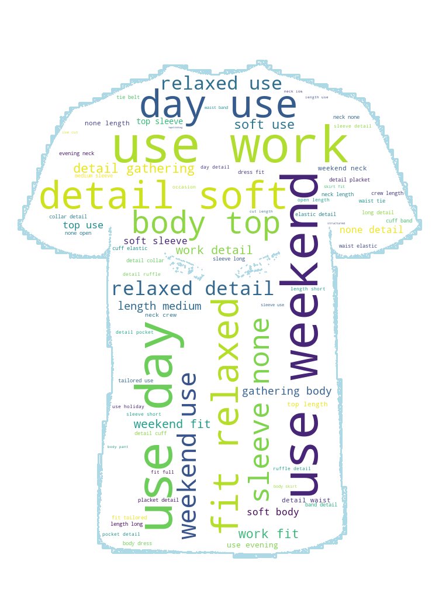

# Resonance Homework 

## Visualizations: 

Please click on the plots to see a bigger figure.  

### Word Clouds 

Word Cloud of Color 1            |  Word Cloud of Color 2         | Word Cloud of Body 
:-------------------------:|:-------------------------:|:-------------------------
  |   | 

### Barplots 

Barplot of Body            |  Barplot of Color         | Barplot of Genre
:-------------------------:|:-------------------------:|:-------------------------
  |   | 

### Pie Charts 

Pie Chart of Brightness             |  Pie Chart of Contrast
:-------------------------:|:-------------------------:
  |  